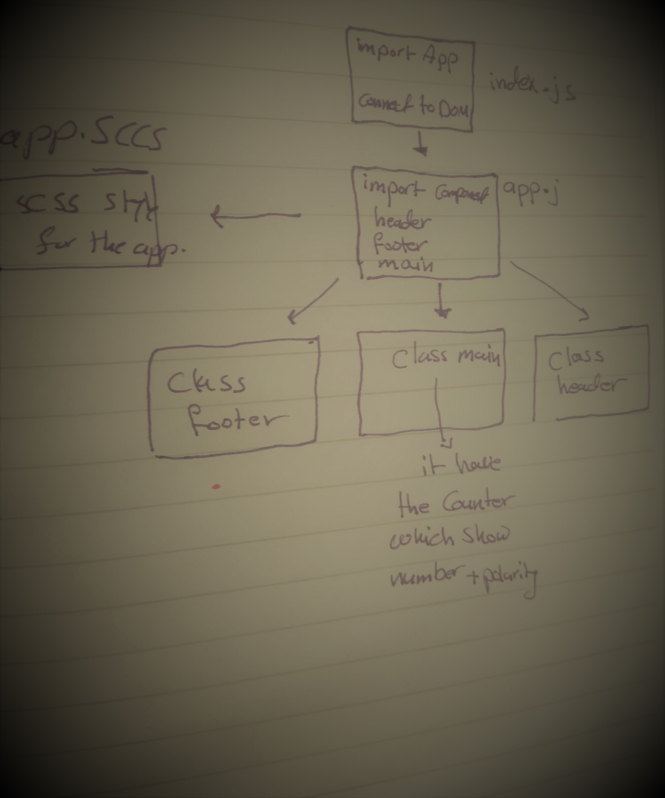

# Component-Based-UI
simple basic React app

## auther
Mai yusuf

## Available Scripts
In the project directory, you can run:

npm start
Runs the app in the development mode.
Open http://localhost:3000 to view it in the browser.

## About app
this a simple react app help to start understand how react app build using classes extend to react app (using this.state and this.props).

a counter application with the following features:
- A Count Display that starts at 0 and updates as the count changes .
- An Increment Button that increases the count by 1.
- An Decrement Button that decreases the count by 1.
- show the polarity of number on change.

## UML:
this show how app connect 
